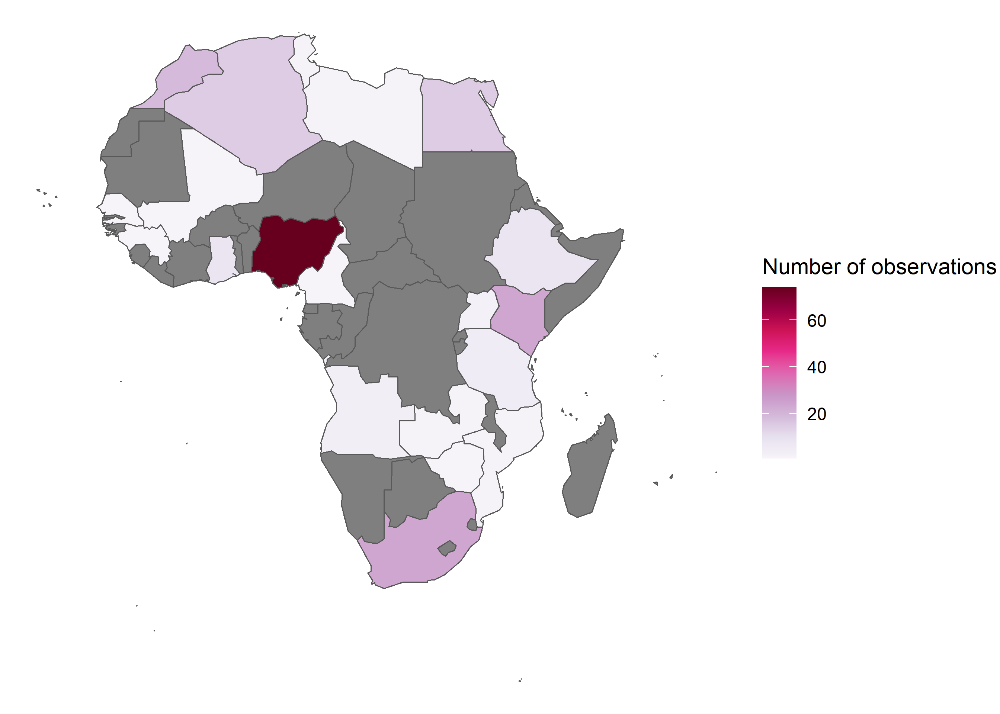
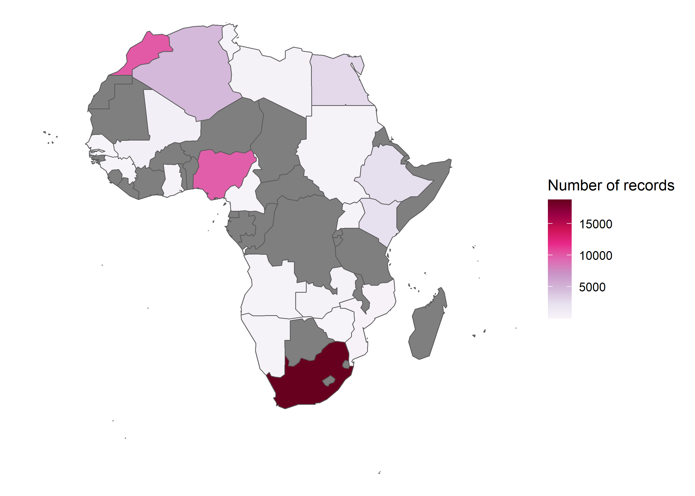
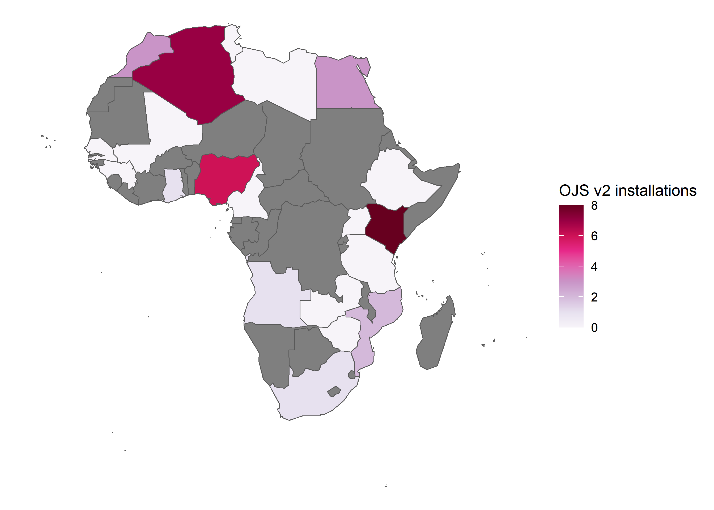
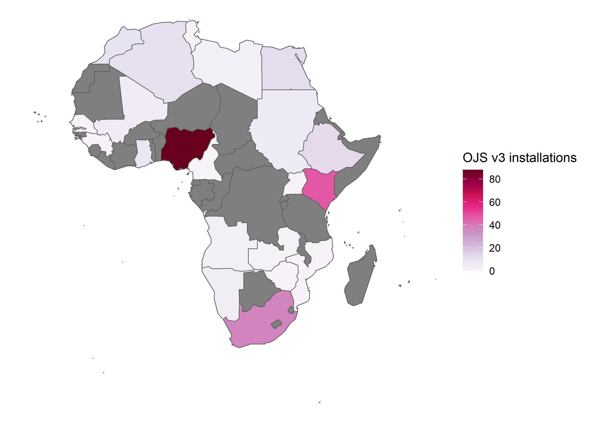

Beacon EDA
================
Saurabh Khanna
2020-09-18

  - [Filtering out observations for
    Africa](#filtering-out-observations-for-africa)
  - [Number of observations](#number-of-observations)
  - [Number of total records](#number-of-total-records)
  - [Number of OJS v2 installations](#number-of-ojs-v2-installations)
  - [Number of OJS v3 installations](#number-of-ojs-v3-installations)

### Filtering out observations for Africa

| country                      |  n | ojs\_v2 | ojs\_v3 | records |
| :--------------------------- | -: | ------: | ------: | ------: |
| Nigeria                      | 74 |       6 |      68 |   12047 |
| Kenya                        | 24 |       8 |      16 |    4986 |
| South Africa                 | 24 |       1 |      16 |   18507 |
| Morocco                      | 19 |       3 |      16 |    4865 |
| Algeria                      | 15 |       7 |       8 |    4738 |
| Egypt                        | 15 |       3 |      11 |    3734 |
| Ethiopia                     |  8 |       0 |       6 |    1903 |
| Ghana                        |  8 |       1 |       7 |     265 |
| Tanzania, United Republic of |  5 |       0 |       5 |     648 |
| Angola                       |  4 |       1 |       3 |       0 |
| Uganda                       |  3 |       0 |       3 |     366 |
| Libya                        |  2 |       0 |       2 |     756 |
| Mozambique                   |  2 |       2 |       0 |     156 |
| Tunisia                      |  2 |       0 |       2 |       0 |
| Zambia                       |  2 |       0 |       2 |     411 |
| Cameroon                     |  1 |       0 |       0 |       0 |
| Guinea                       |  1 |       0 |       1 |       0 |
| Mali                         |  1 |       0 |       1 |     761 |
| Senegal                      |  1 |       0 |       1 |       0 |
| Zimbabwe                     |  1 |       0 |       1 |       0 |

### Number of observations

### Number of total records

### Number of OJS v2 installations

### Number of OJS v3 installations

