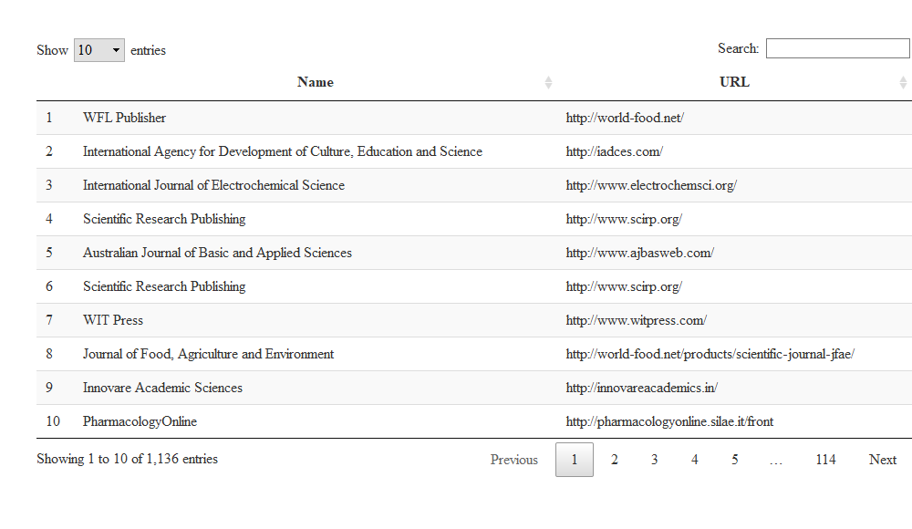

Beacon EDA
================
Saurabh Khanna
2020-09-25

  - [Beacon EDA](#beacon-eda)
      - [Filtering out observations for
        Africa](#filtering-out-observations-for-africa)
      - [Number of observations](#number-of-observations)
      - [Number of total records](#number-of-total-records)
      - [Number of OJS v2
        installations](#number-of-ojs-v2-installations)
      - [Number of OJS v3
        installations](#number-of-ojs-v3-installations)
  - [Predatory journals](#predatory-journals)

## Beacon EDA

### Filtering out observations for Africa

| country       |   n | ojs\_v2 | ojs\_v3 | records |
| :------------ | --: | ------: | ------: | ------: |
| Nigeria       | 119 |      30 |      88 |    9752 |
| Morocco       |  91 |      81 |      10 |   10023 |
| Kenya         |  64 |      17 |      47 |    2398 |
| South Africa  |  47 |       1 |      37 |   18816 |
| Egypt         |  21 |       5 |      12 |    2844 |
| Ethiopia      |  17 |       0 |      13 |    2459 |
| Algeria       |  15 |       4 |      11 |    4690 |
| Ghana         |   9 |       1 |       8 |     296 |
| Tanzania      |   9 |       0 |       6 |     937 |
| Sudan         |   7 |       1 |       6 |     310 |
| Mali          |   5 |       0 |       5 |     683 |
| Angola        |   4 |       1 |       3 |     247 |
| Namibia       |   4 |       0 |       4 |     247 |
| Libya         |   3 |       0 |       3 |     401 |
| Mozambique    |   2 |       1 |       1 |     228 |
| Zambia        |   2 |       0 |       2 |     422 |
| Cameroon      |   1 |       0 |       0 |      53 |
| Côte d’Ivoire |   1 |       0 |       1 |       6 |
| Gambia        |   1 |       0 |       1 |       9 |
| Guinea        |   1 |       0 |       1 |       9 |
| Senegal       |   1 |       0 |       1 |      37 |
| Tunisia       |   1 |       0 |       1 |      43 |
| Uganda        |   1 |       0 |       1 |     173 |
| Zimbabwe      |   1 |       0 |       1 |      35 |

### Number of observations

### Number of total records

### Number of OJS v2 installations

### Number of OJS v3 installations

## Predatory journals

